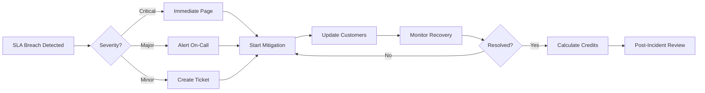

# SLA Targets - n8n Workflow Builder v3.0

## Service Level Agreement Targets and Performance Objectives

This document defines the Service Level Agreement (SLA) targets for the n8n Workflow Builder v3.0.

---

## Table of Contents
1. [Service Availability](#service-availability)
2. [Performance Targets](#performance-targets)
3. [Response Time SLAs](#response-time-slas)
4. [Support SLAs](#support-slas)
5. [Data Guarantees](#data-guarantees)
6. [Monitoring & Reporting](#monitoring--reporting)
7. [SLA Breach Procedures](#sla-breach-procedures)

---

## Service Availability

### Uptime Targets

| Service Tier | Monthly Uptime | Allowed Downtime | Annual Uptime |
|--------------|----------------|------------------|---------------|
| **Enterprise** | 99.99% | 4.32 minutes | 99.99% (52.56 minutes) |
| **Business** | 99.95% | 21.6 minutes | 99.95% (4.38 hours) |
| **Standard** | 99.9% | 43.2 minutes | 99.9% (8.76 hours) |
| **Basic** | 99.5% | 216 minutes | 99.5% (43.8 hours) |

### Availability Calculation

```javascript
// availability_calculator.js
function calculateAvailability(period) {
  const totalMinutes = period.totalMinutes;
  const downtime = period.downtimeMinutes;
  const excludedTime = period.maintenanceMinutes;

  const availability = ((totalMinutes - downtime - excludedTime) / (totalMinutes - excludedTime)) * 100;

  return {
    percentage: availability.toFixed(4),
    uptimeMinutes: totalMinutes - downtime - excludedTime,
    downtimeMinutes: downtime,
    excludedMinutes: excludedTime
  };
}
```

### Exclusions

**Not counted as downtime:**
- Scheduled maintenance windows
- Force majeure events
- Customer-initiated actions
- Third-party service failures
- DDoS attacks

---

## Performance Targets

### Core Metrics

| Metric | Target | Critical Threshold | Measurement |
|--------|--------|-------------------|-------------|
| **API Response Time (p50)** | < 500ms | > 1000ms | Every minute |
| **API Response Time (p95)** | < 2000ms | > 5000ms | Every minute |
| **API Response Time (p99)** | < 5000ms | > 10000ms | Every minute |
| **Workflow Generation Time** | < 15s | > 30s | Per request |
| **Error Rate** | < 0.1% | > 1% | 5-minute average |
| **Successful Request Rate** | > 99.9% | < 99% | Hourly average |

### Workflow-Specific SLAs

| Workflow Type | Generation Time Target | Success Rate |
|---------------|----------------------|--------------|
| Simple (1-5 nodes) | < 5 seconds | > 99.9% |
| Medium (6-15 nodes) | < 15 seconds | > 99.5% |
| Complex (16-30 nodes) | < 30 seconds | > 99% |
| Very Complex (30+ nodes) | < 60 seconds | > 98% |

### Database Performance

| Operation | Target | Critical | Measurement |
|-----------|--------|----------|-------------|
| **Read Query** | < 50ms | > 200ms | p95 |
| **Write Query** | < 100ms | > 500ms | p95 |
| **Connection Time** | < 10ms | > 50ms | p95 |
| **Transaction Time** | < 200ms | > 1000ms | p95 |

---

## Response Time SLAs

### API Endpoint SLAs

```yaml
endpoints:
  - path: "/health"
    method: "GET"
    p50: 50ms
    p95: 100ms
    p99: 200ms

  - path: "/webhook/workflow-builder"
    method: "POST"
    p50: 1000ms
    p95: 5000ms
    p99: 10000ms

  - path: "/form/workflow-builder"
    method: "GET"
    p50: 200ms
    p95: 500ms
    p99: 1000ms

  - path: "/metrics"
    method: "GET"
    p50: 100ms
    p95: 200ms
    p99: 500ms

  - path: "/workflow/{id}"
    method: "GET"
    p50: 100ms
    p95: 300ms
    p99: 1000ms
```

### Geographic Response Times

| Region | Target Latency (p95) | Maximum Latency |
|--------|---------------------|-----------------|
| US East | < 50ms | 100ms |
| US West | < 75ms | 150ms |
| Europe | < 100ms | 200ms |
| Asia Pacific | < 150ms | 300ms |
| South America | < 200ms | 400ms |

---

## Support SLAs

### Response Time by Severity

| Severity | Initial Response | Resolution Target | Escalation |
|----------|-----------------|-------------------|------------|
| **SEV-1** (Critical) | 15 minutes | 4 hours | Immediate |
| **SEV-2** (Major) | 30 minutes | 8 hours | 1 hour |
| **SEV-3** (Minor) | 2 hours | 24 hours | 4 hours |
| **SEV-4** (Low) | 8 hours | 72 hours | 24 hours |

### Support Channels

| Channel | Hours | Response Time | Availability |
|---------|-------|---------------|--------------|
| **Emergency Hotline** | 24/7 | Immediate | Enterprise only |
| **Priority Support** | 24/7 | 30 minutes | Business & above |
| **Email Support** | Business hours | 4 hours | All tiers |
| **Chat Support** | Business hours | 15 minutes | Business & above |
| **Community Forum** | Always | Best effort | All tiers |

### Incident Communication SLA

```markdown
## Incident Updates

SEV-1: Every 15 minutes until resolved
SEV-2: Every 30 minutes until resolved
SEV-3: Every 2 hours until resolved
SEV-4: Daily updates

## Required Information
- Current status
- Impact assessment
- Mitigation steps
- Estimated resolution
- Next update time
```

---

## Data Guarantees

### Data Durability

| Data Type | Durability Target | Backup Frequency | Retention |
|-----------|------------------|------------------|-----------|
| **Workflow Data** | 99.999999999% | Real-time replication | 365 days |
| **Audit Logs** | 99.99999% | Hourly | 7 years |
| **User Data** | 99.9999% | Daily | 90 days |
| **Metrics** | 99.99% | Daily | 30 days |

### Recovery Objectives

| Metric | Target | Maximum |
|--------|--------|---------|
| **Recovery Time Objective (RTO)** | 1 hour | 4 hours |
| **Recovery Point Objective (RPO)** | 15 minutes | 1 hour |
| **Backup Verification** | Daily | Weekly |
| **Restore Test** | Monthly | Quarterly |

### Data Processing SLA

```yaml
data_processing:
  ingestion:
    latency: < 1 second
    throughput: > 1000 requests/second

  storage:
    write_latency: < 50ms
    read_latency: < 10ms

  export:
    small_dataset: < 1 minute
    large_dataset: < 10 minutes

  deletion:
    user_request: < 30 days
    automated_cleanup: daily
```

---

## Monitoring & Reporting

### Real-time Monitoring

```javascript
// sla_monitor.js
class SLAMonitor {
  constructor() {
    this.metrics = {
      availability: new Gauge('availability_percentage'),
      responseTime: new Histogram('response_time_ms'),
      errorRate: new Rate('error_rate'),
      successRate: new Rate('success_rate')
    };
  }

  checkSLA(metric, value) {
    const slaTarget = this.getSLATarget(metric);
    const status = value <= slaTarget.critical ? 'BREACH' :
                   value <= slaTarget.warning ? 'WARNING' :
                   'OK';

    if (status === 'BREACH') {
      this.triggerAlert(metric, value, slaTarget);
    }

    return {
      metric,
      value,
      target: slaTarget.target,
      status,
      timestamp: new Date()
    };
  }

  async generateReport(period) {
    const report = {
      period,
      availability: await this.calculateAvailability(period),
      performance: await this.calculatePerformance(period),
      incidents: await this.getIncidents(period),
      slaCompliance: await this.calculateCompliance(period)
    };

    return report;
  }
}
```

### SLA Dashboard Metrics

```sql
-- SLA compliance query
WITH sla_metrics AS (
  SELECT
    DATE(created_at) as date,
    COUNT(*) as total_requests,
    SUM(CASE WHEN processing_time_ms < 2000 THEN 1 ELSE 0 END) as within_sla,
    AVG(processing_time_ms) as avg_response_time,
    PERCENTILE_CONT(0.95) WITHIN GROUP (ORDER BY processing_time_ms) as p95_response_time,
    SUM(CASE WHEN error = true THEN 1 ELSE 0 END) as errors
  FROM workflow_audit_log
  WHERE created_at >= NOW() - INTERVAL '30 days'
  GROUP BY DATE(created_at)
)
SELECT
  date,
  total_requests,
  ROUND(100.0 * within_sla / total_requests, 2) as sla_compliance_pct,
  avg_response_time,
  p95_response_time,
  ROUND(100.0 * errors / total_requests, 4) as error_rate_pct
FROM sla_metrics
ORDER BY date DESC;
```

### Monthly SLA Report

```markdown
# Monthly SLA Report Template

## Executive Summary
- Overall Availability: XX.XX%
- SLA Compliance: XX.XX%
- Total Incidents: XX
- Customer Impact: XX hours

## Availability Metrics
| Week | Uptime % | Downtime (min) | Incidents |
|------|----------|----------------|-----------|
| Week 1 | | | |
| Week 2 | | | |
| Week 3 | | | |
| Week 4 | | | |

## Performance Metrics
| Metric | Target | Achieved | Compliance |
|--------|--------|----------|------------|
| Response Time (p95) | < 2s | | |
| Error Rate | < 0.1% | | |
| Success Rate | > 99.9% | | |

## Incident Summary
| Date | Duration | Impact | Root Cause |
|------|----------|--------|------------|
| | | | |

## Action Items
- [ ] Item 1
- [ ] Item 2

## Credits/Penalties
- SLA Credits Due: $XXX
- Service Credits Applied: $XXX
```

---

## SLA Breach Procedures

### Breach Detection

```javascript
// breach_detection.js
async function detectSLABreach(metric, value, threshold) {
  if (value > threshold) {
    const breach = {
      id: uuid(),
      metric,
      value,
      threshold,
      severity: calculateSeverity(value, threshold),
      timestamp: new Date(),
      duration: 0
    };

    // Start breach timer
    breachTimers[breach.id] = setInterval(() => {
      breach.duration++;
      if (breach.duration % 5 === 0) {
        notifyStakeholders(breach);
      }
    }, 60000);

    // Trigger immediate response
    await triggerBreachResponse(breach);

    return breach;
  }
}

async function triggerBreachResponse(breach) {
  // 1. Alert on-call
  await pageOnCall(breach);

  // 2. Create incident
  const incident = await createIncident(breach);

  // 3. Start mitigation
  await startMitigation(breach);

  // 4. Update status page
  await updateStatusPage(breach);

  // 5. Log for audit
  await logBreach(breach);
}
```

### Service Credits

| Availability | Credit Percentage |
|--------------|------------------|
| 99.9% - 99.99% | 0% |
| 99.0% - 99.9% | 10% |
| 95.0% - 99.0% | 25% |
| < 95.0% | 50% |

### Credit Calculation

```javascript
function calculateServiceCredit(availability, monthlyFee) {
  let creditPercentage = 0;

  if (availability < 95.0) {
    creditPercentage = 50;
  } else if (availability < 99.0) {
    creditPercentage = 25;
  } else if (availability < 99.9) {
    creditPercentage = 10;
  }

  const creditAmount = (monthlyFee * creditPercentage) / 100;

  return {
    availability: `${availability}%`,
    creditPercentage: `${creditPercentage}%`,
    creditAmount: `$${creditAmount.toFixed(2)}`,
    appliedTo: 'Next billing cycle'
  };
}
```

### Breach Response Timeline



---

## Continuous Improvement

### SLA Review Process

**Quarterly Review:**
- Analyze SLA performance
- Identify trends
- Adjust targets if needed
- Update monitoring

**Annual Review:**
- Comprehensive SLA audit
- Benchmark against industry
- Technology assessment
- Contract renegotiation

### Improvement Initiatives

```yaml
improvement_tracking:
  - initiative: "Response Time Optimization"
    target_improvement: "20%"
    timeline: "Q2 2024"
    status: "In Progress"

  - initiative: "Availability Enhancement"
    target_improvement: "0.09%"
    timeline: "Q3 2024"
    status: "Planning"

  - initiative: "Error Rate Reduction"
    target_improvement: "50%"
    timeline: "Q1 2024"
    status: "Completed"
```

---

## Legal & Compliance

### SLA Terms

- Measurement Period: Monthly
- Reporting: Monthly reports within 5 business days
- Credit Requests: Must be submitted within 30 days
- Maximum Credit: 50% of monthly fee
- Dispute Resolution: 30-day resolution period

### Compliance Requirements

- **ISO 27001**: Information security management
- **SOC 2 Type II**: Security, availability, processing integrity
- **GDPR**: Data protection and privacy
- **HIPAA**: Healthcare data (if applicable)

---

Last Updated: 2024-01-17
Version: 3.0.0
Review Date: 2024-04-17